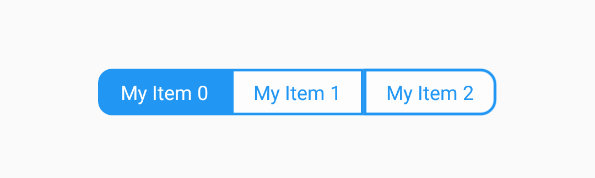
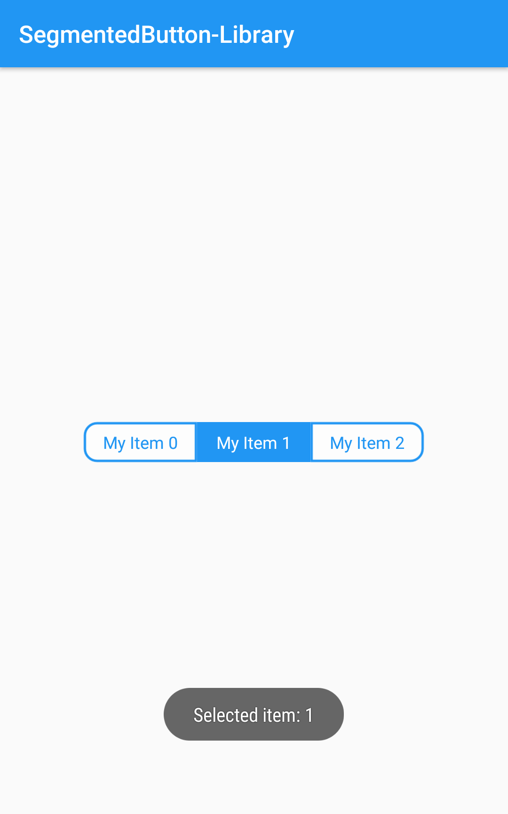

# SegmentedButton-Library

## Preview


- On Selection


## Gradle Dependency
- gradle project level
 ```gradle 
allprojects {
    repositories {
        // ...
        maven { url 'https://jitpack.io' }
    }
}
```
- gradle application level
```gradle 
dependencies {
    implementation 'com.github.FabrizioBilleciUNICT:SegmentedButton-Library:0.1.0'
 }
 ```


## Usage
In your Layout
 ```XML
     <com.codedix.segmentedbutton.SegmentedButtonView
        android:id="@+id/radioView"
        android:layout_width="wrap_content"
        android:layout_height="wrap_content"
        android:layout_centerInParent="true"/>
```

In your Activity
 ```kotlin
    val selectedItemIndex = 0
    val adapter = SegmentedButtonAdapter(
      this, 
      arrayListOf("My Item 0", "My Item 1", "My Item 2"),
      selectedItemIndex
    )
    radioView.setAdapter(adapter)
    adapter.onItemSelected = { index ->
        Toast.makeText(this, "Selected item: $index", Toast.LENGTH_SHORT).show()
    }
```
